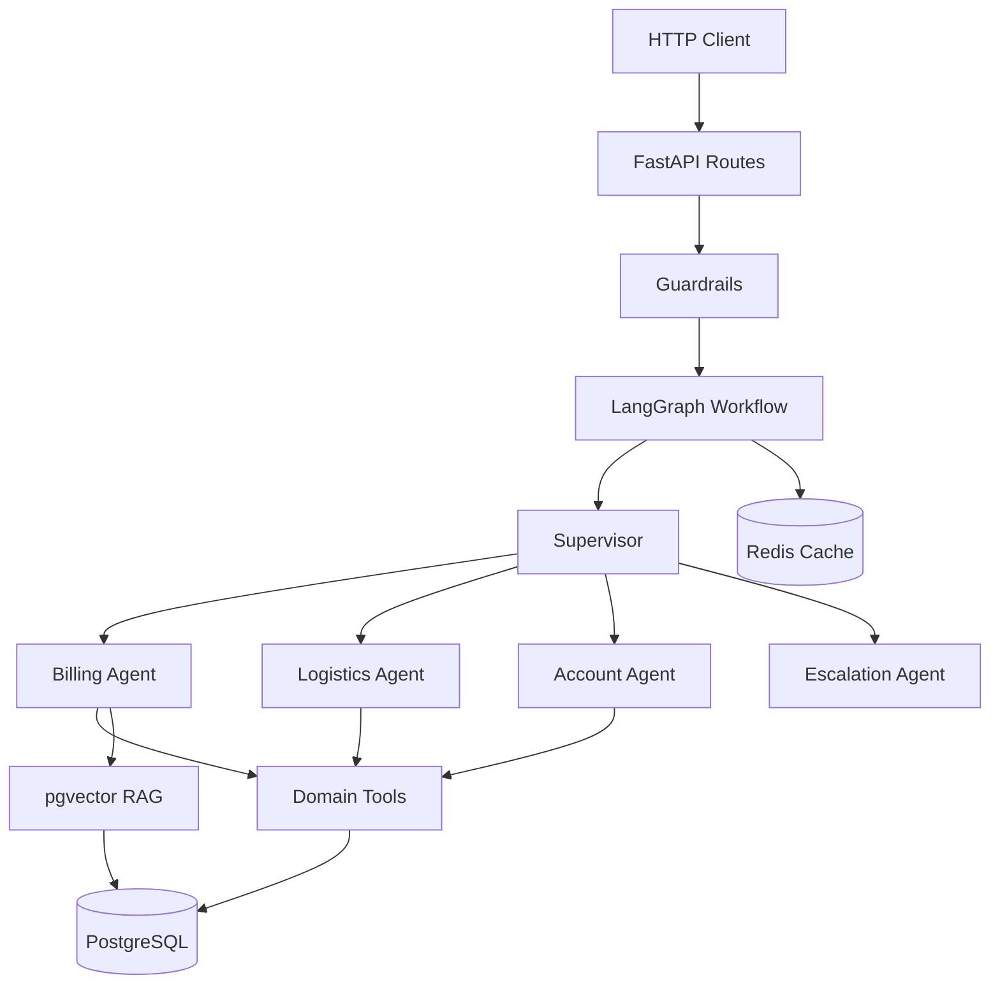

# AI Customer Support Platform

Agent-centric customer support platform where a **supervisor** identifies ticket intent, delegates to **domain agents** (billing, logistics, account), enables agents to use authorized tools and RAG over a knowledge base, and escalates to humans when automation cannot resolve the case.

## Stack

- **API:** FastAPI, Pydantic, Uvicorn
- **Agents:** LangGraph (supervisor + domain workers)
- **LLM:** OpenAI (configurable via env)
- **RAG:** PostgreSQL + pgvector
- **Cache:** Redis
- **Observability:** OpenTelemetry, Langfuse
- **Testing:** pytest, evaluation datasets
- **Infrastructure:** Docker, Docker Compose, GitHub Actions
- **Frontend:** Next.js (Customer Portal + Support Console in `web/`)

## Architecture



## Quickstart

### Prerequisites

- Python 3.12 (managed via uv)
- Docker and Docker Compose
- OpenAI API key

### Setup

```bash
# Copy environment file
cp .env.example .env
# Edit .env with your OPENAI_API_KEY

# Bootstrap (Windows) — sets UV_LINK_MODE=copy to avoid hardlink errors
./scripts/bootstrap.ps1

# Or manually (Windows: always use copy link mode)
$env:UV_LINK_MODE = "copy"   # PowerShell
uv sync --link-mode=copy
docker compose up -d db redis
uv run alembic upgrade head
uv run python scripts/seed_demo.py
uv run python scripts/ingest_kb.py
uv run fastapi dev
```

### Frontend

```bash
cp web/.env.example web/.env.local
cd web
npm install
npm run dev
```

- Customer portal: http://localhost:3000
- Support console: http://localhost:3000/login (default password `console`)
- API docs: http://localhost:8000/docs

The UI talks to FastAPI through a Next.js BFF (`/api/support/*`). The API key stays on the server.

**Database URL:** local development uses PostgreSQL on host port **5433** (`localhost:5433`) so Docker does not conflict with a local Postgres on 5432. See `.env.example`.

#### Windows notes

On Windows, `uv` may fail with **os error 396** (*cloud operation incompatible with hardlinks*) when the project, `.venv`, or `%LOCALAPPDATA%\uv` cache is on a cloud-synced or filtered path. The bootstrap script sets `UV_LINK_MODE=copy` and uses `C:\uv-cache` by default when `UV_CACHE_DIR` is unset.

If problems persist:

- Prefer a local path such as `C:\dev\your-project` (outside OneDrive).
- Or set `UV_PROJECT_ENVIRONMENT=C:\venvs\your-project` so `.venv` is not inside a synced folder.
- Rebuild the environment: `Remove-Item -Recurse -Force .venv` then `uv sync --link-mode=copy`.

#### Common issues

| Symptom | Fix |
|---------|-----|
| Postgres auth failed on port 5432 | Use `localhost:5433` in `DATABASE_URL` (Docker maps `5433:5432`) |
| `ProactorEventLoop` in seed/ingest scripts | Fixed in `scripts/` — use latest code; Windows needs `SelectorEventLoop` |
| API fails on startup with `CREATE INDEX CONCURRENTLY` | Checkpointer pool needs `autocommit=True` in `app/graph/workflow.py` |
| `fastapi dev` reload loop on `.venv` | Use `uv run fastapi run` or stop `uv sync` while server runs |

Full troubleshooting: `.agents/skills/project-setup/` (also documented in [AGENTS.md](AGENTS.md)).

API available at `http://localhost:8000`. Docs at `http://localhost:8000/docs`.

### API Usage

All endpoints require `X-API-Key` header (default: `dev-key` from `.env.example`).

```bash
# Health check
curl http://localhost:8000/health

# Create ticket
curl -X POST http://localhost:8000/tickets \
  -H "X-API-Key: dev-key" \
  -H "Content-Type: application/json" \
  -d '{
    "customer_email": "customer@example.com",
    "customer_name": "Customer",
    "subject": "Refund request",
    "description": "I was charged twice for INV-1001"
  }'

# Resolve ticket
curl -X POST http://localhost:8000/tickets/{ticket_id}/resolve \
  -H "X-API-Key: dev-key" \
  -H "Content-Type: application/json" \
  -d '{"messages": [{"role": "user", "content": "Please refund duplicate charge on INV-1001"}]}'
```

## Project Structure

See [AGENTS.md](AGENTS.md) for the full layer map and agent development guide.

## Testing

```bash
uv run pytest tests/unit -v
uv run pytest tests/integration -v
uv run pytest tests/evaluation -v
```

## Evaluation Baselines

| Metric | Threshold |
|--------|-----------|
| Intent accuracy | >= 80% |
| Escalation accuracy | >= 70% |
| Keyword coverage | >= 60% |
| Groundedness | >= 50% |

Run full LLM evaluation with OpenAI key: label PR with `run-evaluation`.

## Environment Variables

See [.env.example](.env.example) for all configuration options.

## License

See [LICENSE](LICENSE).
