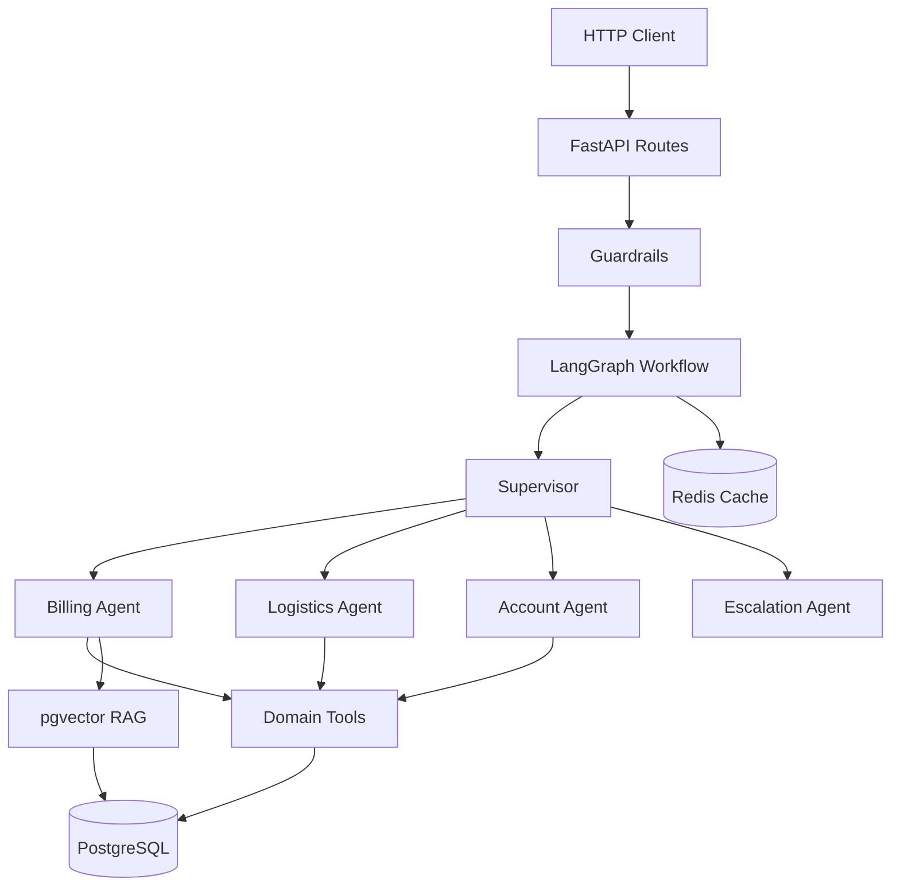

# AI Customer Support Platform

Agent-centric customer support platform where a **supervisor** identifies ticket intent, delegates to **domain agents** (billing, logistics, account), enables agents to use authorized tools and RAG over a knowledge base, and escalates to humans when automation cannot resolve the case.

## Stack

- **API:** FastAPI, Pydantic, Uvicorn
- **Agents:** LangGraph (supervisor + domain workers)
- **LLM:** OpenAI (configurable via env)
- **RAG:** PostgreSQL + pgvector
- **Cache:** Redis
- **Observability:** OpenTelemetry, Langfuse
- **Testing:** pytest, evaluation datasets
- **Infrastructure:** Docker, Docker Compose, GitHub Actions

## Architecture



## Quickstart

### Prerequisites

- Python 3.12 (managed via uv)
- Docker and Docker Compose
- OpenAI API key

### Setup

```bash
# Copy environment file
cp .env.example .env
# Edit .env with your OPENAI_API_KEY

# Bootstrap (Windows)
./scripts/bootstrap.ps1

# Or manually
uv sync
docker compose up -d db redis
uv run alembic upgrade head
uv run python scripts/seed_demo.py
uv run python scripts/ingest_kb.py
uv run fastapi dev
```

API available at `http://localhost:8000`. Docs at `http://localhost:8000/docs`.

### API Usage

All endpoints require `X-API-Key` header (default: `dev-key` from `.env.example`).

```bash
# Health check
curl http://localhost:8000/health

# Create ticket
curl -X POST http://localhost:8000/tickets \
  -H "X-API-Key: dev-key" \
  -H "Content-Type: application/json" \
  -d '{
    "customer_email": "customer@example.com",
    "customer_name": "Customer",
    "subject": "Refund request",
    "description": "I was charged twice for INV-1001"
  }'

# Resolve ticket
curl -X POST http://localhost:8000/tickets/{ticket_id}/resolve \
  -H "X-API-Key: dev-key" \
  -H "Content-Type: application/json" \
  -d '{"messages": [{"role": "user", "content": "Please refund duplicate charge on INV-1001"}]}'
```

## Project Structure

See [AGENTS.md](AGENTS.md) for the full layer map and agent development guide.

## Testing

```bash
uv run pytest tests/unit -v
uv run pytest tests/integration -v
uv run pytest tests/evaluation -v
```

## Evaluation Baselines

| Metric | Threshold |
|--------|-----------|
| Intent accuracy | >= 80% |
| Escalation accuracy | >= 70% |
| Keyword coverage | >= 60% |
| Groundedness | >= 50% |

Run full LLM evaluation with OpenAI key: label PR with `run-evaluation`.

## Environment Variables

See [.env.example](.env.example) for all configuration options.

## License

See [LICENSE](LICENSE).
